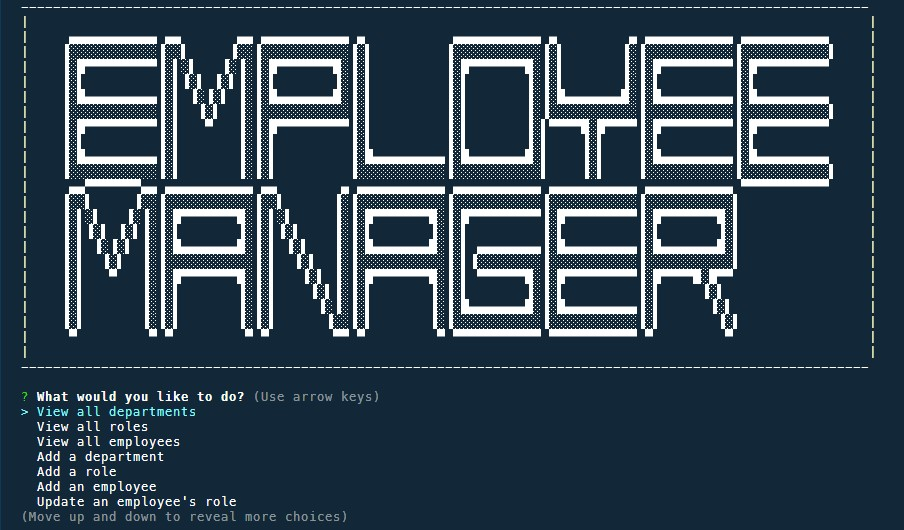

# Employee Tracker

## Description

This is a command-line application that allows you to manage a company's employee database, using Node.js, Inquirer, and MySQL.

## Usage

When you start the application, you will be presented with the following options:

- View all departments
- View all roles
- View all employees
- Add a department
- Add a role
- Add an employee
- Update an employee role
- Quit

You can choose an option using the arrow keys and press Enter.

If you choose to view all departments, roles, or employees, you will see a formatted table with the relevant information.

If you choose to add a department, role, or employee, you will be prompted to enter the required information and the database will be updated accordingly.

If you choose to update an employee role, you will be prompted to select an employee and their new role and the database will be updated accordingly.

If you choose to Quit, the application will end.

## Demo

[Video demonstration](https://drive.google.com/file/d/1_7u7lzDd4U4VlS3q7M4u3tlvxIZzp6ay/view)
